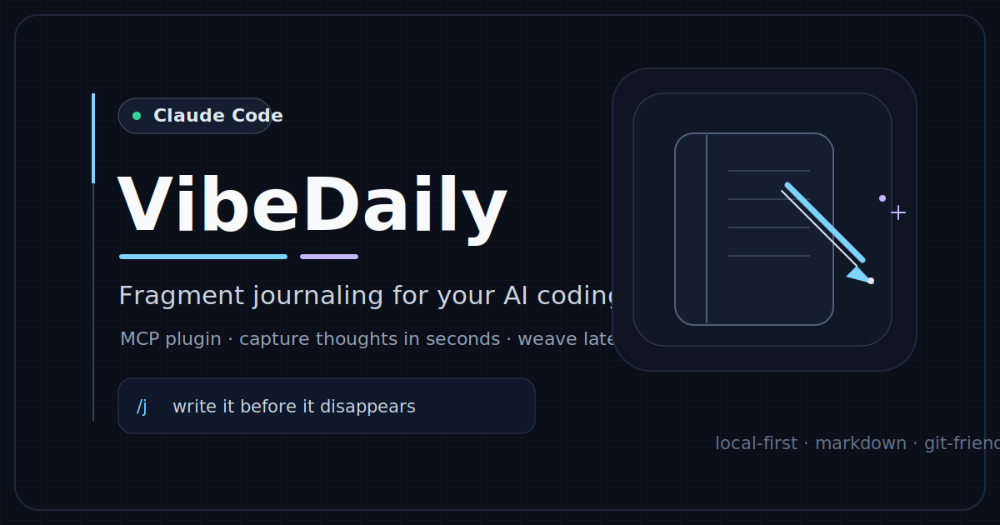
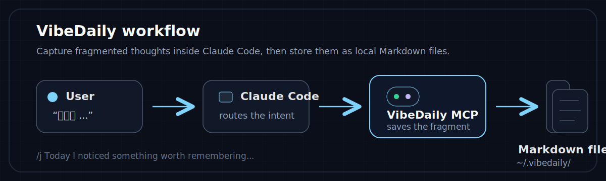

# VibeDaily

<p align="center">
  
</p>

**在 Claude Code 里碎片化写日记和小说。**

VibeDaily 是一个 MCP（模型上下文协议）插件，将 Claude Code 变成一个日记本。几秒钟内记录灵感、捕捉想法、或者写小说片段——不用离开终端、不用切换工具。

## 快速开始

```bash
git clone https://github.com/XS-dev/VibeDaily.git
cd VibeDaily
npm install
npm run build
```

打开项目时，Claude Code 会通过 `.mcp.json` 自动启动 MCP 服务器。

### 全局使用（任意目录可用）

让 VibeDaily 在所有目录下都能工作：

```bash
# 注册为用户级 MCP 服务器
claude mcp add vibedaily -s user -- node /你的绝对路径/VibeDaily/dist/index.js

# 可选：全局启用 /j 快捷命令
cp .claude/commands/j.md ~/.claude/commands/j.md
```

之后在任何目录下，`记一下`、`jot`、`/j` 都能正常工作。

## 功能

<p align="center">
  
</p>

### 零摩擦记录

| 你说 / 做 | 发生了什么 |
|-----------|-----------|
| `记一下：刚才想到一个点子` | 自动调用 `jot`，立即保存 |
| `/j 今天有点焦虑` | 同上，通过快捷命令 |
| `diary: feeling productive` | 英文自动触发 |
| `Ctrl+V` 粘贴一张图片 | 图片附加到碎片 |

不用切换终端，不用手动确认，不用管文件。

### 19 个 MCP 工具

#### 碎片 CRUD
| 工具 | 功能 |
|------|------|
| `jot` | 记录碎片。content 是唯一必填字段。自动推断类型。支持标签、角色、地点、图片、base64 图片。 |
| `quick_jot` | 极简日记入口。自动创建项目、自动日期标签。支持 `append: true` 追加到今天最后一条。 |
| `list_fragments` | 按项目/类型/标签筛选，分页，最新优先。 |
| `get_fragment` | 完整读取——内容、元数据、图片、警告。 |
| `update_fragment` | 编辑内容、类型、标签、图片。全部可选。 |
| `delete_fragment` | 按 ID 永久删除，连同关联图片。 |
| `search_fragments` | 全文搜索所有项目。 |

#### 项目管理
| 工具 | 功能 |
|------|------|
| `create_project` | 新建日记或小说项目。 |
| `list_projects` | 列出所有项目及元数据。 |
| `set_current_project` | 设置 `jot` 的默认项目。 |
| `get_current_project` | 显示当前活跃项目。 |

#### 角色与地点（小说写作）
| 工具 | 功能 |
|------|------|
| `add_character` | 添加角色：名称、别名、性格、描述、备注。 |
| `list_characters` | 列出项目中所有角色。 |
| `update_character` | 编辑角色信息。 |
| `add_place` | 添加地点：名称、描述、备注。 |
| `list_places` | 列出项目中所有地点。 |
| `update_place` | 编辑地点信息。 |

#### AI 辅助写作
| 工具 | 功能 |
|------|------|
| `weave` | 按 ID 或筛选条件选取碎片，返回完整内容供 Claude 编织成章。 |
| `merge_fragments` | 按 ID 列表或日期合并碎片。可选删除源碎片。图片内联嵌入正文。 |

### 图片支持

`jot`、`quick_jot`、`update_fragment` 均支持两个图片参数：

| 参数 | 来源 | 格式 |
|------|------|------|
| `images` | 文件路径 | 绝对路径（来自 Ctrl+V 粘贴） |
| `imageAttachments` | Data URL | `data:image/png;base64,...` |

**校验：** 单张上限 10MB。允许类型：PNG、JPEG、GIF、WebP、SVG。不合规输入产生警告而非静默失败。图片以相对路径（`../images/`）存储，从碎片 Markdown 文件可直接解析。

### 合并与追加

- **`merge_fragments`**：将多条碎片合并为一条，用 `### HH:MM` Markdown 标题分隔。源图片复制到新碎片目录，正文中内联为 ``。可选 `delete_source` 在合并后删除源碎片。
- **`quick_jot(append: true)`**：追加到今日最后一条日记末尾，带时间戳标题。若今日尚无日记则回退为新建碎片。

### 类型自动推断

未指定 `type` 时，工具根据内容关键词自动推断：

- **diary**（日记）— 今天、日记、昨天、心情、早上、晚上
- **novel**（小说）— 角色、场景、章节、小说、chapter
- **idea**（灵感）— 灵感、想法、idea、todo
- **note**（笔记）— 无法匹配时的默认类型

项目级别的类型（`diary` / `novel`）优先于关键词匹配。

## 数据目录

```
vibedaily-data/                   （项目根目录，已 .gitignore）
  config.json                     — 全局配置（当前项目）
  projects/{slug}/
    meta.json                     — 项目元数据
    characters.json               — 角色档案
    places.json                   — 地点档案
    fragments/*.md                — Markdown + YAML frontmatter
    images/{fragment-id}/*        — 附件图片
```

碎片为 Markdown 文件 + gray-matter frontmatter——人类可读、Git 友好。首次运行时，数据自动从 `~/.vibedaily/` 迁移。

## 使用示例

```text
# 快速日记
记一下：今天在等AI干活的时候写了个日记插件

# 用 /j 命令
/j 番茄一块多一个，苹果两块五，樱桃四十一小盒，告辞

# 追加到今日
记日记：又想到一件事   （自动 append: true）

# 合并今天的碎片
合并今天的日记
```

## 开发

```bash
npm run build    # TypeScript 编译
npm start        # 运行 MCP 服务器
npm run dev      # 编译 + 运行
```

## 技术栈

- TypeScript, Zod v4
- [MCP SDK](https://github.com/modelcontextprotocol/typescript-sdk)
- [gray-matter](https://github.com/jonschlinkert/gray-matter)
